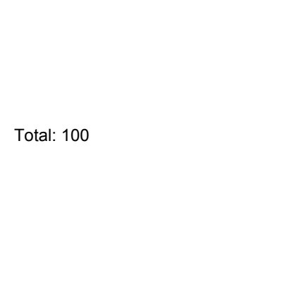

# WhatsApp: evidência local de 272ec4e

LOCAL ONLY. Real decoding, inbox, authenticated main CLI and SQLite. No LLM. Deterministic fixture interpretation; synthetic audio with injected STT. Transport and delivery receipts simulated. Real-account acceptance remains pending with main.

| Entrada | Resposta textual da fixture | Recibo simulado |
| --- | --- | --- |
| text | 37 + 5 = 42. | delivered |
| image | A prévia mostra um quadrado preto sobre fundo branco. | delivered |
| pdf | O total informado no arquivo é 100. | delivered |
| voice | 37 + 5 = 42. | delivered |
| silent-video | Os quadros amostrados mostram vermelho; nenhuma fala foi detectada pelo transcritor de fixture. | delivered |
| txt | O total informado no arquivo é 100. | delivered |
| docx | O documento contém 3 valores Total: 100; soma 300. A representação alternativa da caixa não foi contada novamente. | delivered |
| xlsx | Ordem das abas: Receita (A1: 200), Despesa (A1: 100). Diferença: 100. | delivered |
| pptx | A sequência da apresentação é Slide 10, Slide 2, Slide 1. | delivered |

## Prévias reais inspecionadas

## Evidência e reprodução

Os JSONs preservam claim da CLI autenticada de fixture, pedido, texto enviado e estado SQLite após recibo simulado. Pillow, PDFium e FFmpeg reais; interpretação determinística sem LLM; tom sintético com STT injetado. Nenhum serviço ou consumidor real ativado.

`run-targeted.py` executa os 41 testes de `selectors.json`; todos passaram, sem skips. `replay-local-flow.py` registra nove fluxos até resposta e recibo. A primeira tentativa omitia SHA-256 em voz/vídeo e foi corretamente recusada; corrigidos os metadados da fixture, o ensaio completo passou. `compare-docx.py` executa o mesmo arquivo nas CLIs anterior (d417e30) e atual (272ec4e), reproduzindo a duplicação somente na anterior.

Preparação local: `python3.12 -m venv .wa-test-venv`, `.wa-test-venv/bin/python -m pip install Pillow==12.3.0 pypdfium2==5.13.0`, criar `.wa-test-scratch`. Executar os scripts desta pasta a partir da raiz do worktree, com `TMPDIR="$PWD/.wa-test-scratch" PYTHONDONTWRITEBYTECODE=1 .wa-test-venv/bin/python <script>`. FFmpeg/ffprobe já estavam disponíveis.

A suíte completa, linters e outras fases não foram executados. O teste de serviço que chama plutil -lint ficou fora da seleção. Aceitação na conta real, com STT e principal instalados, permanece pendente e pertence ao principal.
